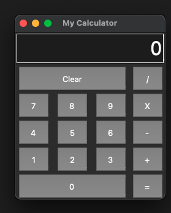

# This is my Simple Calculator build by Tkinter

## What can it do?
Simple calculation like multipy, add, substract and divide 

## Limitatation
Unlike normal calculator, if you press / + * - button the second time, it won't (yet) show the result. 

